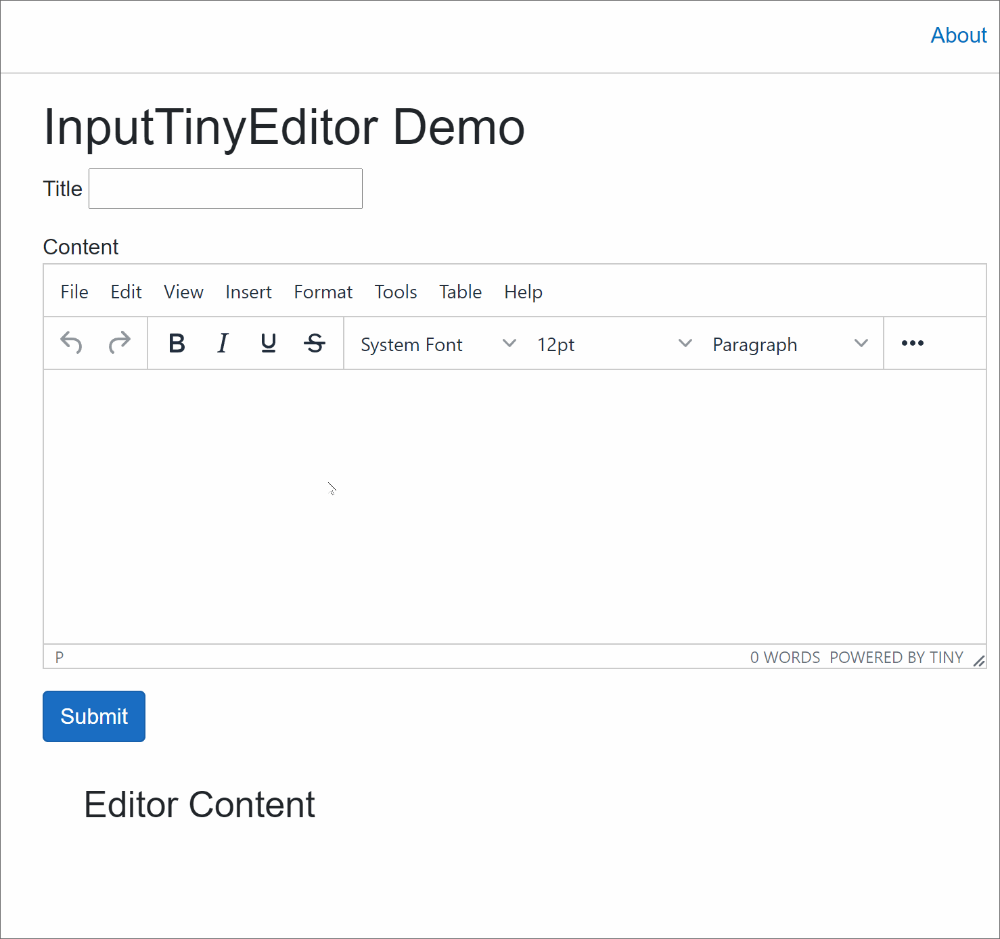

# InputTinyEditor

An Input component wrapping TinyMCE Blazor Component,  to be used inside an EditForm component. It offers the same validations experience as Blazor’s build-in form components out of the box. 

# Changelog

1. 1.0.0: Initial release

1. 1.0.1: Validation is merged into the official TinyMCE Blazor component. This component offers a few configuration parameters for convenience.



## Installation

### Nuget Manager

Search for *InputTinyMCEEditor.Blazor* and install.

### Powershell

```powershell
Install-Package InputTinyMCEEditor.Blazor
```

### the dotnet CLI

```bash
dotnet add package InputTinyMCEEditor.Blazor
```

## Usage

Once the package is installed, you can use the component straight away. There is no extra JavaScript script to add.

```razor
<EditForm OnValidSubmit="@Submit" EditContext="@CurrentEditContext">
    <DataAnnotationsValidator />
    <p>
        <label>Title</label>
        <InputText @bind-Value="Model.Title"></InputText>
        <ValidationMessage For="() => Model.Title" />
    </p>
    <p>
        <label>Content</label>
        <InputTinyMCEEditor.Blazor.InputTinyEditor For="() => Model.Content"
                                                   @bind-Value="Model.Content"
                                                   Height="300" />
        <ValidationMessage For="() => Model.Content" />
    </p>
    <button class="btn btn-primary" type="submit">Submit</button>
</EditForm>

@code {
    public Model Model { get; set; } = new Model();
    private EditContext? CurrentEditContext;

    protected override void OnInitialized()
    {
        CurrentEditContext = new(Model);
        base.OnInitialized();
    }

    private void Submit()
    {
        Console.WriteLine($"Title is {Model.Title}");
        Console.WriteLine($"Content is {Model.Content}");
    }

}
```

## Required Parameters

Parameter `For` of type `Expression<Func<string>>` is required to provide identifier for validations

## TinyMCE Editor Configurations

InputTinyEditor comes with default configurations, including Non-Premium Plugins and entire menubar and toolbar

### Add Configurations via Parameters

InputTinyEditor is extended from the original TinyCME.Blazor.Editor. It inherits and supports all the params from TinyMCE.Blazor.Editor. See more [here]( https://www.tiny.cloud/docs/integrations/blazor/#configuringthetinymceblazorintegration).

Additional Parameters:

1.	InputTinyEditor provides the following parameters of type string for quick configuration: `Plugins`, `Toolbar`, `Menubar`. 

```razor
<InputTinyMCEEditor.Blazor.InputTinyEditor For="() => Model.Content"
@bind-Value="Model.Content" Height="300" Menubar="file edit view insert format tools table"/>
```

2.	Additional configurations can be added through `Conf` parameter

```razor
<InputTinyMCEEditor.Blazor.InputTinyEditor For="() => Model.Content"
                @bind-Value="Model.Content" Height="300" Conf="AdditionalConf"/>
@code{
	private Dictionary<string, object> AdditionalConf = new Dictionary<string, object>
    {
        {"quickbars_selection_toolbar", "bold italic | quicklink h2 h3 blockquote quickimage quicktable"}
    };
}
```

3. You can also add configurations by adding key/value pairs as attributes.

```razor
<InputTinyMCEEditor.Blazor.InputTinyEditor For="() => Model.Content"
    @bind-Value="Model.Content"
    quickbars_selection_toolbar="bold italic | quicklink h2 h3 blockquote quickimage quicktable"
                                                   />
```

4.	By default InputTinyEditor trigger validation when `onchange` event fires. You can change the trigger to `oninput` by specifying `ValidateOnInput` to `true`.

```razor
<InputTinyMCEEditor.Blazor.InputTinyEditor For="() => Model.Content"
    @bind-Value="Model.Content" ValidationOnInput="@true"
/>
```

### Add Configurations via JavaScript Script

1. For the configurations that include complex objects or functions, it is easier to add them via a script. By design, InputTinyEditor will look for `window.tinyMceConf` object and append to existing configurations. To add additional configurations, add a `script` tag in the `index.html` or `_layout.cshtml`.

```html
<body>
…
<script>
        window.tinyMceConf = {
            file_picker_callback: function (callback, value, meta) {
                /* Provide file and text for the link dialog */
                if (meta.filetype === 'file') {
                    callback('https://www.google.com/logos/google.jpg', { text: 'My text' });
                }

                /* Provide image and alt text for the image dialog */
                if (meta.filetype === 'image') {
                    callback('https://www.google.com/logos/google.jpg', { alt: 'My alt text' });
                }

                /* Provide alternative source and posted for the media dialog */
                if (meta.filetype === 'media') {
                    callback('movie.mp4', { source2: 'alt.ogg', poster: 'https://www.google.com/logos/google.jpg' });
                }
            }
        }
    </script>
</body>
```

2. To hook up to TinyMCE Editor’s events, create a `window.tinyMceSetup` function that takes `editor` as parameter and add events on the `editor` as below. InputTinyEditor component will append this function to existing setup script. Note, `oninput` and `onchange` events are used to trigger validations. If you need to add extra behaviours to these two events, you can copy the code from source code and add your code.

```html
<body>
    ...
    <script>
        window.tinyMceSetup = (editor) => {
            editor.on("init", () => console.log("TinyMCE editor initialized"))
        };
    </script>
</body>
```